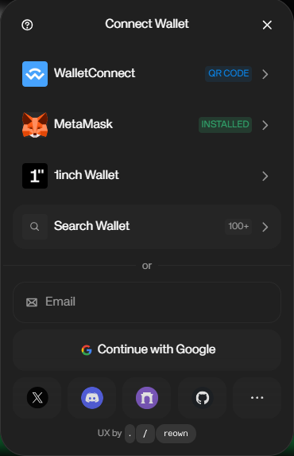
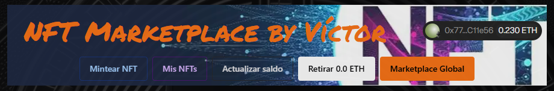
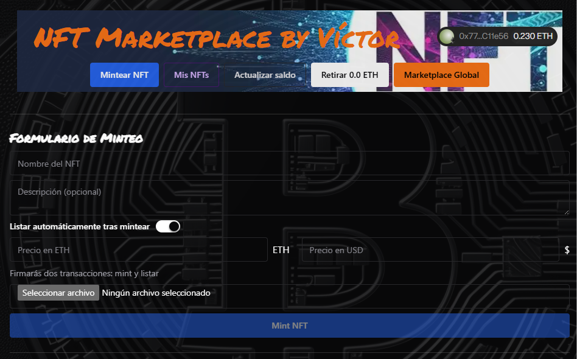
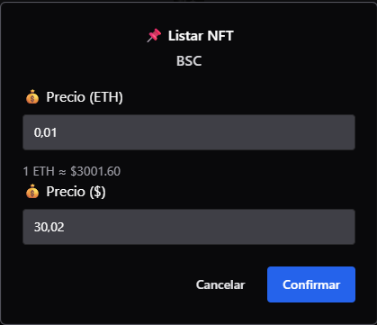
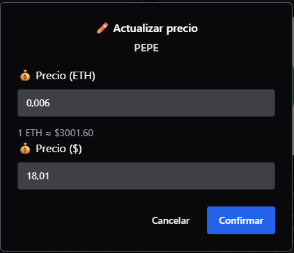
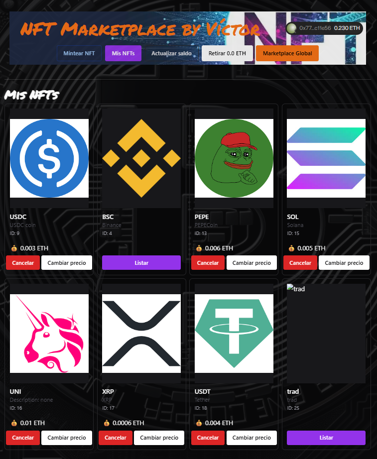

# 🖥️ Frontend – NFT Marketplace

DApp en React + Vite que permite conectar tu wallet, mintear, listar, comprar y gestionar NFTs desplegados en la red Sepolia.

## 🚀 Stack

- React 19 + Vite
- Chakra UI
- Ethers v6
- Reown AppKit (conector de wallets)
- NFT.storage (vía JWT) para subir metadata/imagenes

## 🧱 Estructura

```
Marketplace/frontend/
  public/
    screenshots/
  src/
    components/      # UI (layout, botones, formularios)
    hooks/           # lógica compartida (listings, precio ETH, etc.)
    services/        # llamadas al backend y utilidades de RPC/IPFS
    utils/           # helpers de contratos y formatos
    App.jsx, main.jsx
```

## ✅ Prerrequisitos

- Node.js 18+ (`nvm use`)
- Backend corriendo y accesible (sirve `/api/config/appkit` y `/api/marketplace`)
- Variables de entorno configuradas (ver abajo)

## 🔐 Variables de entorno

Crea `.env` en `Marketplace/frontend/` con:

- `VITE_BACKEND_URL`: URL del backend (por defecto `http://localhost:4000`).
- `VITE_NFT_ADDRESS`: dirección del contrato NFT desplegado en Sepolia.
- `VITE_MARKET_ADDRESS`: dirección del Marketplace desplegado.
- `VITE_MARKET_DEPLOY_BLOCK`: bloque en que se desplegó el Marketplace (para paginar eventos).
- Opcionales para ajustar carga/paginación (ya tienen defaults): `VITE_GLOBAL_BATCH_TARGET`, `VITE_GLOBAL_MAX_PAGES`, `VITE_BLOCK_PAGE`, `VITE_PAGE_DELAY_MS`, `VITE_AUTOLOAD_GLOBAL` (`true`/`false`).

Ejemplo:

```bash
VITE_BACKEND_URL=http://localhost:4000
VITE_NFT_ADDRESS=0x...
VITE_MARKET_ADDRESS=0x...
VITE_MARKET_DEPLOY_BLOCK=0
VITE_AUTOLOAD_GLOBAL=true
```

## 🧭 Scripts

```bash
npm run dev      # arranca Vite en modo desarrollo
npm run build    # compila para producción
npm run preview  # sirve la build localmente
npm run lint     # lint con ESLint
```

## 🔄 Puesta en marcha (local)

```bash
cd Marketplace/frontend
nvm use
npm install
npm run dev
```

Abre `http://localhost:5173`.

## ⚙️ Notas de funcionamiento

- Al cargar, la app pide `projectId` al backend en `/api/config/appkit`. Asegúrate de tener `APPKIT_PROJECT_ID` configurado en el backend.
- El backend ya gestiona RPC y subida a IPFS, así que no necesitas configurar `VITE_RPC_SEPOLIA` ni `VITE_PINATA_JWT` en el frontend.

## 📄 Vistas principales

- **Panel de usuario**: mint + listado opcional, gestión de MisNFTs (listar/cambiar precio/cancelar), proceeds y retirada.
- **Marketplace global**: NFTs en venta con filtros (texto, rango de precio) y orden por precio o recencia.
- Navegación pública: se pueden ver listados sin conectar wallet.

## 📸 Capturas

<p align="center">
  <strong>Conectar wallet</strong><br />
  
</p>
<p align="center">
  <strong>Panel de usuario</strong><br />
  
</p>
<p align="center">
  <strong>Formulario de minteo</strong><br />
  
</p>
<p align="center">
  <strong>Listado propio / listar</strong><br />
  
</p>
<p align="center">
  <strong>Actualizar precio</strong><br />
  
</p>
<p align="center">
  <strong>Mis NFTs</strong><br />
  
</p>
<p align="center">
  <strong>Marketplace global</strong><br />
  
</p>
